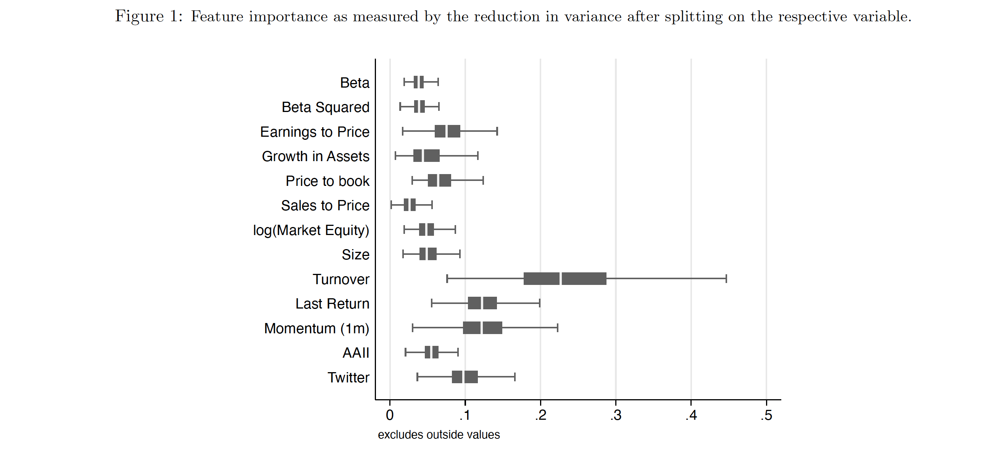

# Trading-Game - Group 41
This game is played in the course Asset Pricing at the VU Amsterdam.

### The rules of the game
The trading orders can only be handed in on Fridays. It is only possible to buy shares of EURO STOXX 600 companies. The portfolio score is calculated as 
```
r - 0.25* SD
```
, where r is the daily return and SD is daily standard deviation. At least 85% of the capital have to be invested. While the winners of the game receive a small grade boost, the grade is based on the variety and complexity of employed strategies. They should reflect the lecture topics of the respective week. 

### Week 1
In week 1, we based our strategy on a Markowitz portfolio and used the grading function as target. First we calculated the average returns of the respective stocks and the variance-covariance matrix. 

To attain portfolio weights,  we initially solved the following optimisation problem 

```
min_{w}  -(w * R’ - 0.25 * (w’ * Sigma * w) ^1/2)
s.t    0.85 <= sum w_i <= 1
       0 < w_i < 1 
```

where w is a vector of weights w_i, R is a vector of average daily returns and Sigma is the variance-covariance matrix of returns. Note that for computational ease, we have rephrased the maximisation problem as a minimisation problem. This initial approach resulted in a very concentrated portfolio. As we deemed this undesirable, we decided to adjust the optimisation problem in two ways: 

1. a punishment term was added to the target function. The function e^(sum(w * log(w)’)) is large for weights close to zero and for weights close to 1. 
2. the maximum investment into one stock was limited to 10%.

The minimisation problem then became

```
min_{w}  -(w * R’ - 0.25 * (w’ * Sigma *w) ^1/2 - e^(sum(w * log(w)’)))
s.t    0.85 <= sum w_i <= 1
	     0 < w_i < 0.1 
```

### Week 2
In week 2, we decided to put 85% of our capital in a momentum and the remaining 15% in a reversal portfolio. For construction of the momentum portfolio, we first calculated the 3 month momentum. We then sorted the stocks by momentum and selected the top 30%. We then selected the weights to be proportional to the momentum increase (i.e. stocks with a higher momentum also had a higher portfolio weight). For the mean reversal strategy, we selected
the stocks that decreased the most in the last trading month. If stocks were eligible for both strategies, the weights were added up.

### Week 3
We decided to base our strategy on Kaczmarek and Perez (2021). They use a random forest to predict returns and then build Markowitz portfolios based on these predicted returns. Essentially, the forest preselects the stocks of the portfolio. They show that portfolios using these techniques outperform conventional portfolios based historic returns. 

A nice feature of random forests is that they do by definition not overfit. Hence, we can use a variety of different features. We also decided to include the Bull-Bear spread of the weekly AAII sentiment survey and a daily economic uncertainty indicator based on short messages from the social media platform Twitter ([Economic Policy Uncertainty Index](https://www.policyuncertainty.com/twitter_uncert.html)).  

The features used are 
* short-term momentum
* recent maximum return
* turnover 
* log market equity  
* volume 
* return volatility 
* market beta and the squared beta
* earnings-to-price
* sales-to-price  
* asset growth
* AAII Sentiment
* Twitter Sentiment

Note that ideally, we would have preferred longer data horizons and even more variables, but we have limited access to data (i.e. the Factset excel add-in is only available for Microsoft devices). Most importantly, we decided against a conventional split in a training and testing dataset (*shame on us*).

After training the random forest and predicting the returns, we built portfolios using our adjusted optimisation method from week 1.

As a by-product of our approach, we can obtain the [Gini importance](mljar.com/blog/feature-importance-in-random-forest/) of the explanatory variables. The
measure describes how much of the variance of stock X was explained by each feature. Figure 1 is a boxplot
of the feature importance. Turnover, as a measure for liquidity risk, momentum (1 month and one day), as
well as the twitter uncertainty index seem to be relatively important for the prediction of the stock return.



### Week 4
We decided to merely rebalance our portfolio weights using new data. 

### Week 5 
We added the Almihud illiquidity to our approach from week 3.


	
	  
